# TradeSta Protocol Guide

Complete guide to understanding how the TradeSta perpetual futures protocol works on Avalanche C-Chain.

---

## Overview

TradeSta is a decentralized perpetual futures exchange where traders can:
- Open leveraged long/short positions on crypto assets (AVAX, BTC, ETH, etc.)
- Trade without expiration dates (perpetual contracts)
- Use USDC as collateral across all markets
- Access up to 50x leverage on some markets

---

## Protocol Architecture: The Four-Contract System

Each market in TradeSta consists of **four interconnected contracts** that work together:


### Contract Roles

**MarketRegistry** (Factory):
- Deploys new markets (24 markets currently deployed)
- Coordinates access control (admin, keepers)
- Single source of truth for all markets

**PositionManager** (Core Trading):
- Creates and closes positions
- Handles liquidations
- Tracks open interest (longs/shorts)
- Emits: `PositionCreated`, `PositionClosed`, `PositionLiquidated`, `CollateralSeized`

**Orders** (Limit Order Book):
- Creates limit orders
- Executes when price reached
- Cancels orders
- Emits: `LimitOrderCreated`, `LimitOrderExecuted`, `LimitOrderCancelled`

**Vault** (Collateral Storage):
- Holds all USDC collateral for the market
- Must remain solvent (balance >= obligations)
- Security-critical: Emergency withdrawal exists (admin-only)

**FundingTracker** (Funding Rates):
- Calculates funding rates based on long/short imbalance
- Stores epoch data for historical rates
- **Currently inactive** (funding frozen at zero)

---

## How a Trade Works: Position Lifecycle


### Step-by-Step Breakdown

**1. User Wants to Trade**
- Deposits USDC to their wallet
- Chooses market (e.g., ETH/USD)
- Decides: long/short, leverage, collateral amount
- Approves USDC spending to PositionManager

**2. User Creates Position (Permissionless)**
- User (or anyone on their behalf) calls `PositionManager.createMarketPosition()`
- USDC collateral transferred from user to Vault
- Position recorded with entry price from Pyth oracle
- Liquidation price calculated based on leverage
- `PositionCreated` event emitted with position details

**3. Position Stays Open**
- Funding payments accrue based on long/short imbalance *(currently zero - see below)*
- User can monitor position via events or contract queries
- Mark price continuously compared to liquidation price

**4. Position Closes** (three ways):

**Normal Close (Permissionless)**:
- User (or anyone on their behalf) calls `closePosition()`
- PnL calculated: (exit price - entry price) × position size
- Collateral ± profit returned to user
- `PositionClosed` event emitted

**Price Liquidation** (permissionless):
- Mark price reaches liquidation price
- **Anyone** can call `liquidatePosition()`
- Liquidator receives liquidation fee as incentive
- Remaining collateral goes to vault (insurance pool)
- `PositionLiquidated` event emitted

**Funding Liquidation** (currently impossible):
- Cumulative funding fees >= remaining collateral
- Can liquidate **profitable positions** if funding drains collateral
- `CollateralSeized` event emitted
- **Status**: Never occurred (funding rate is zero)

---

## Critical Mechanism: Dual Liquidation System

TradeSta implements **two separate liquidation mechanisms**:

```mermaid
graph LR
    P[Position Open] --> C{Liquidation Check}

    C -->|Price ≤ Liq Price<br/>for Longs| PL[Price-Based<br/>Liquidation]
    C -->|Price ≥ Liq Price<br/>for Shorts| PL
    C -->|Funding Fees ≥<br/>Collateral| FL[Funding-Based<br/>Liquidation]
    C -->|User Closes| NC[Normal Close]

    PL -->|PositionLiquidated| LF[Liquidator Gets Fee<br/>Vault Gets Rest]
    FL -->|CollateralSeized| VF[Vault Gets All]
    NC -->|PositionClosed| UR[User Gets<br/>Collateral ± PnL]

    style PL fill:#ff9999,stroke:#333,stroke-width:2px,color:#000
    style FL fill:#ffcc99,stroke:#333,stroke-width:2px,color:#000
    style NC fill:#99ff99,stroke:#333,stroke-width:2px,color:#000
    style P fill:#e1f5ff,stroke:#333,stroke-width:2px,color:#000
```



### 1. Price-Based Liquidation - **ACTIVE**

**Trigger**: Mark price reaches liquidation price
- **For Longs**: Current price ≤ liquidation price
- **For Shorts**: Current price ≥ liquidation price

**Who Can Liquidate**: Anyone (permissionless)
- Any address can call `liquidatePosition(positionId, priceUpdateData)`
- Liquidator receives liquidation fee (economic incentive)
- Decentralized system - no single liquidator required

**What Happens**:
1. Liquidator calls `liquidatePosition()` with Pyth price update
2. Contract verifies price breach and position is liquidatable
3. Liquidator receives liquidation fee from collateral
4. Remaining collateral transferred to Vault (insurance pool)
5. `PositionLiquidated` event emitted with liquidator address

**Production Status**: ✅ **ACTIVE** (as of November 14, 2025)
- 6,276 liquidations across all 24 markets
- Liquidation rate: 46.3% of positions
- Functioning as designed

### 2. Funding-Based Liquidation - **DISABLED**

**Trigger**: Cumulative funding fees >= remaining collateral

**Who Can Liquidate**: Anyone (permissionless)
- Any address can call `qualifiesForFundingRateLiquidation()`
- No liquidation fee for funding liquidations
- Decentralized system - no single liquidator required

**Unique Feature**: Can liquidate **profitable positions**
- Even if mark price is favorable, funding can drain collateral
- Protects protocol from negative funding rate exposure

**What Happens**:
1. Anyone calls `qualifiesForFundingRateLiquidation()`
2. Contract checks if `funding_owed >= collateral_remaining`
3. All remaining collateral seized by Vault
4. `CollateralSeized` event emitted

**Production Status**: ❌ **DISABLED** (effectively impossible)
- 0 occurrences in production
- **Why**: Funding rate frozen at zero (see next section)
- Funding fees never accumulate, so this trigger never fires

---

## Funding Rates: Currently Disabled

TradeSta includes a perpetual funding rate mechanism designed to balance long/short interest:

**Intended Design:**


**Current Reality ❌:**


### How It Should Work

**Funding Rate Formula**:
```
k = K0 + BETA × ln(1 + skew)

where:
  skew = |longs/shorts - 1|
  K0 = base rate
  BETA = sensitivity parameter
```

**Economic Incentive**:
- **More longs than shorts**: Longs pay shorts → Discourages longs, encourages shorts
- **More shorts than longs**: Shorts pay longs → Discourages shorts, encourages longs
- **Balanced**: Minimal funding payments
- **Goal**: Keep long/short ratio near 1:1

**Update Mechanism**:
- Rates update periodically (epoch-based)
- Whitelisted keeper calls `FundingTracker.logEpoch()`
- New rate locked in, cumulative index updated
- Positions accumulate funding based on epochs held

### Current Production Status ❌

**Critical Finding**: Funding mechanism is completely inactive:

| Parameter | Expected | Actual | Status |
|-----------|----------|--------|--------|
| Funding Rate | Dynamic (±X% per epoch) | **0** | ❌ Frozen |
| Epoch Counter | Increments regularly | **2** (only 1 epoch) | ❌ Stalled |
| Epoch Size | 1-8 hours | **0 seconds** | ❌ Not configured |
| Last `logEpoch()` | Recent | **June 5, 2025** | ❌ Never updated |
| Funding Payments | Occurring | **Zero** | ❌ Disabled |

**Evidence**:
```
Query: FundingTracker.epochToFundingRates(1) for AVAX/USD market
Result:
  epochStartTime: June 5, 2025 11:47:47 UTC
  currentEpoch: 1
  currentFundingRate: 0 (raw)
  direction: 0 (balanced)
  indexValue: 0

Query: FundingTracker.epochCounter()
Result: 2 (only 1 epoch logged)

Query: FundingTracker.epochSize()
Result: 0 seconds (not configured)
```

### Implications

**What This Means**:
1. **Traders pay/receive ZERO funding fees** - regardless of market imbalance
2. **Positions can be held indefinitely** - no funding cost accumulation
3. **No economic balancing** - extreme long/short imbalances have no cost
4. **Funding liquidations impossible** - `CollateralSeized` can never trigger
5. **Protocol behaves like traditional futures** - not true perpetual swaps

**Why It Matters**:
- Traditional perps use funding to maintain peg to spot price
- Without funding, TradeSta relies solely on arbitrage for price discovery
- Allows parasitic strategies (hold winning side indefinitely at no cost)
- Only price-based liquidation active for risk management

---

## Access Control: Hybrid Permission Model

TradeSta uses a sophisticated hybrid model with three distinct access levels:

**Traders (Permissionless):**

```mermaid
graph LR
    Trader[👤 Trader] -->|✅ Anyone| CreatePos[Open Market Position]
    Trader -->|✅ Anyone| ClosePos[Close Position]
    Trader -->|✅ Anyone| CreateOrder[Create Limit Order]
    Trader -->|✅ Anyone| CancelOrder[Cancel Limit Order]

    style CreatePos fill:#e1ffe1,stroke:#333,stroke-width:2px,color:#000
    style ClosePos fill:#e1ffe1,stroke:#333,stroke-width:2px,color:#000
    style CreateOrder fill:#e1ffe1,stroke:#333,stroke-width:2px,color:#000
    style CancelOrder fill:#e1ffe1,stroke:#333,stroke-width:2px,color:#000
```


**Keepers (Whitelisted - 2 addresses):**

```mermaid
graph LR
    Keeper[🔑 Keeper<br/>KEEPER_ROLE] -->|🔑 Restricted| ExecOrder[Execute Limit Order]
    Keeper -->|🔑 Restricted| UpdateFunding[Update Funding Epoch]

    style ExecOrder fill:#fff4e1,stroke:#333,stroke-width:2px,color:#000
    style UpdateFunding fill:#fff4e1,stroke:#333,stroke-width:2px,color:#000
    style Keeper fill:#ffd700,stroke:#333,stroke-width:2px,color:#000
```


**Liquidators (Permissionless):**

```mermaid
graph LR
    Liquidator[⚡ Liquidator] -->|✅ Anyone| PriceLiq[Price Liquidation]
    Liquidator -->|✅ Anyone| FundingLiq[Funding Liquidation]

    style PriceLiq fill:#e1ffe1,stroke:#333,stroke-width:2px,color:#000
    style FundingLiq fill:#e1ffe1,stroke:#333,stroke-width:2px,color:#000
```


**Admin (Single EOA):**
- Deploy new markets via MarketRegistry
- Update keeper whitelist
- Emergency vault withdrawal (security concern)

### Keepers (Whitelisted - 2 Addresses)

**Responsibilities**:
- **Limit Order Execution**: Only keepers can call `executeLimitOrder()` when trigger price reached
- **Funding Epochs**: Only keepers can call `logEpoch()` to update funding rates

**Purpose**:
- Controlled execution of triggered limit orders
- Coordinated funding rate updates across protocol

**Trade-off**:
- Requires trust in keeper infrastructure
- Keepers must be online and responsive
- Potential centralization risk

**Current Keepers**:
- `0xAEE2ee1c899ecB6313A3c80DDAac40f2e1f6d9C4`
- `0x65fD3d40F9c2FD34c4ec54a3d0A0BC9900C8a3A1`

### Liquidators (Permissionless - Anyone)

**Responsibilities**:
- **Price Liquidations**: Anyone can call `liquidatePosition()` when conditions met
- **Funding Liquidations**: Anyone can call `qualifiesForFundingRateLiquidation()`

**Purpose**:
- Decentralized liquidation mechanism
- Economic incentive via liquidation fees
- No single point of failure for system health

**How It Works**:
1. Monitor positions via events or contract queries
2. Check if liquidation price reached
3. Call `liquidatePosition()` with Pyth price update
4. Receive liquidation fee if successful

**Economics**:
- Liquidator receives fee from position collateral
- Remaining collateral goes to Vault
- Competitive market: First liquidator wins

### Admin (Single EOA)

**Responsibilities**:
- Deploy new markets via MarketRegistry
- Update keeper whitelist
- Emergency vault withdrawal (security concern)

**Current Admin**: `0xe28bD6B3991F3e4b54AF24EA2F1eE869c8044a93`

---

## Summary

TradeSta is a **four-contract perpetual futures system** with:

✅ **Strengths**:
- Clean architecture separating concerns
- Permissionless liquidations for decentralization
- Dual liquidation mechanisms for comprehensive risk management
- Keeper model prevents MEV on position entry

⚠️ **Current Limitations**:
- **Funding mechanism disabled** - operates like traditional futures, not perps
- Requires trust in keeper infrastructure for position entry
- Only one of two liquidation mechanisms is active

🔍 **Verification Insight**:
This protocol demonstrates complete understanding through:
- Reconstructing all position lifecycles from events
- Discovering inactive funding mechanism via on-chain queries
- Identifying hybrid permission model (keepers vs liquidators)
- Verifying vault solvency and protocol health

---

**For technical implementation details**, see [TECHNICAL_DETAILS.md](TECHNICAL_DETAILS.md)

**For verification script usage**, see [VERIFICATION_GUIDE.md](VERIFICATION_GUIDE.md)
