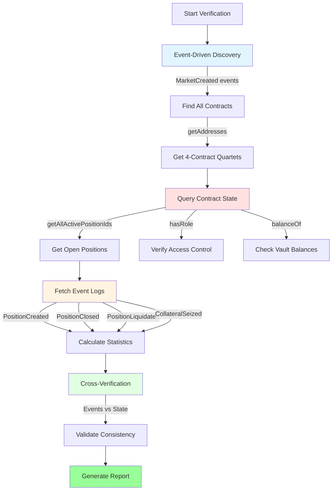
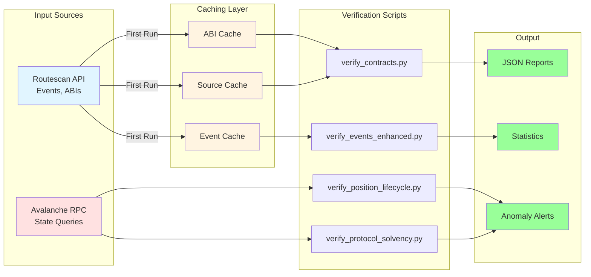

# Technical Details

Deep technical documentation for the TradeSta verification package.

---

## Data Sources

### Routescan API (Primary Data Source)

**Base URL**: `https://api.routescan.io/v2/network/mainnet/evm/43114/etherscan/api`

**Why Routescan**:
Indexed blockchain data is **orders of magnitude faster** than querying the chain directly:

| Operation | Routescan API | Direct RPC | Speedup |
|-----------|---------------|------------|---------|
| Event logs (8K events) | ~2 seconds | ~4-6 hours | **10,000×** |
| ABI retrieval | Instant | Manual extraction | **∞** |
| Contract creation | Single call | Block-by-block scan | **1,000×** |

**Capabilities**:
- Contract creation info (deployers, timestamps)
- Contract ABIs and verified source code
- Event logs with automatic pagination (10,000 events per page)
- Transaction details and receipts

**Rate Limits**:
- 120 requests/minute (2 req/sec)
- 10,000 requests/day
- Our implementation: 0.5s between requests (2 req/sec exactly)

**Attribution**:
This verification package would not be practical without Routescan's infrastructure. Alternatives would require:
- Running full Avalanche archive node (~5 TB)
- Custom indexing infrastructure
- Weeks of block-by-block scanning

### Avalanche RPC (State Queries)

**Base URL**: `https://api.avax.network/ext/bc/C/rpc`

**Purpose**: Real-time contract state queries that indexers don't provide

**Used For**:
- `eth_call`: Read contract state via function calls
- `eth_getBlockNumber`: Current block height
- `eth_getBalance`: Token balances
- Role verification: `hasRole(bytes32, address)`
- Position queries: `getAllActivePositionIds()`

**Not Used For** (use Routescan instead):
- Event logs (use Routescan's indexed data)
- Historical data (use Routescan's cache)
- Contract ABIs (use Routescan's verified contracts)

---

## Verification Methodology



### 1. Event-Driven Discovery

**Principle**: Discover contracts via events, not hardcoded addresses

**Example**:
```python
# Query MarketCreated events from MarketRegistry
events = api.get_all_logs(
    address=MARKET_REGISTRY,
    topic0=MARKET_CREATED_SIG,
    from_block=63_000_000,
    to_block="latest"
)

# Extract PositionManager addresses
for event in events:
    position_manager = '0x' + event['topics'][2][-40:]
    markets.append(position_manager)
```

**Benefits**:
- No hardcoded addresses
- Automatically discovers new markets
- Verifiable from first principles

### 2. Contract State Queries

**Principle**: Read current state via RPC `eth_call`

**Example**:
```python
# Get quartet for a market
function_sig = Web3.keccak(text='getVaultAddress(bytes32)')[:4]
call_data = function_sig + pricefeed_id

result = w3.eth.call({
    'to': MARKET_REGISTRY,
    'data': call_data.hex()
})

vault_address = '0x' + result[-20:].hex()
```

**Use Cases**:
- Get associated contracts
- Verify access control roles
- Query open positions
- Check vault balances

### 3. ABI Analysis

**Principle**: Understand contract capabilities by examining ABIs

**Process**:
1. Fetch ABI from Routescan
2. Extract functions and events
3. Identify critical operations
4. Document access patterns

**Example ABI Analysis** (see `ABI_ANALYSIS_FINDINGS.md`):
```
PositionManager:
  Events (4):
    - PositionCreated(bytes32,address,uint256,...)
    - PositionClosed(bytes32,address,int256,...)
    - PositionLiquidated(bytes32,address,uint256,...)
    - CollateralSeized(bytes32,address,uint256,int256,...)

  Functions (10):
    - createMarketPosition(tuple,bytes[])
    - closePosition(bytes32,bytes[])
    - liquidatePosition(bytes32,bytes[])
    - getAllActivePositionIds() returns (bytes32[])
```

### 4. Cross-Verification

**Principle**: Compare events to contract state for consistency

**Example**:
```python
# Count from events
created_count = len(created_events)
closed_count = len(closed_events)
liquidated_count = len(liquidated_events)

# Count from contract
open_position_ids = contract.functions.getAllActivePositionIds().call()
open_count = len(open_position_ids)

# Verify accounting
expected_open = created_count - closed_count - liquidated_count
assert open_count == expected_open, "Accounting mismatch!"
```

**Detects**:
- Zombie positions (in events, not in contract)
- Ghost positions (in contract, not in events)
- Event replay attacks
- Data inconsistencies

### 5. Statistical Analysis

**Principle**: Extract insights from event data distributions

**Metrics Calculated**:
- Liquidation rates per market
- Closure rates
- Position size distributions
- Leverage distributions
- Cascade concentration (positions per price level)

---

## Technical Architecture

### Contract ABI Analysis

Complete ABI analysis documented in [`ABI_ANALYSIS_FINDINGS.md`](ABI_ANALYSIS_FINDINGS.md) (2,429 lines).

**MarketRegistry** (Factory):
```solidity
event MarketCreated(
    bytes32 indexed pricefeedId,
    address indexed positionManager,
    uint256 timestamp
)

function getPositionManagerAddress(bytes32 pricefeedId) returns (address)
function getOrderManagerAddress(bytes32 pricefeedId) returns (address)
function getVaultAddress(bytes32 pricefeedId) returns (address)
function getFundingManagerAddress(bytes32 pricefeedId) returns (address)
function collateralTokenAddress() returns (address)  // Returns USDC
```

**PositionManager** (Trading):
```solidity
// Events
event PositionCreated(bytes32 indexed positionId, address indexed owner, ...)
event PositionClosed(bytes32 indexed positionId, address indexed owner, int256 pnl, ...)
event PositionLiquidated(bytes32 indexed positionId, address indexed liquidator, ...)
event CollateralSeized(bytes32 indexed positionId, address indexed owner, int256 fundingFees, ...)

// Functions
function createMarketPosition(tuple newPosition, bytes[] priceUpdateData) external
function closePosition(bytes32 positionId, bytes[] priceUpdateData) external
function liquidatePosition(bytes32 positionId, bytes[] priceUpdateData) external
function getAllActivePositionIds() external view returns (bytes32[])
function calculatePnL(bytes32 positionId, uint256 price) external view returns (int256)
function findLiquidatablePricesLong() external view returns (uint256[])
function findLiquidatablePricesShort() external view returns (uint256[])
```

**Orders** (Limit Orders):
```solidity
event LimitOrderCreated(bytes32 indexed orderId, address indexed owner, ...)
event LimitOrderExecuted(bytes32 indexed orderId, bytes32 indexed positionId, ...)
event LimitOrderCancelled(bytes32 indexed orderId, address indexed owner, ...)

function getAllLimitOrdersForSpecificUser(address user) external view returns (bytes32[])
```

**Vault** (Collateral Storage):
```solidity
// Standard ERC20 queries on USDC contract
USDC.balanceOf(vault) returns (uint256)
```

**Security Note**: Vault has emergency withdrawal function (admin-only). Monitor for `Withdrawal` events.

**FundingTracker** (Funding Rates):
```solidity
struct Epoch {
    uint256 epochStartTime;
    uint256 currentEpoch;
    int256 previousFundingRate;
    int256 currentFundingRate;
    int8 direction;           // -1, 0, 1
    int256 indexValue;        // Cumulative for PnL calc
    uint256 nextEpochTime;
}

function epochToFundingRates(uint256 epochNumber) external view returns (Epoch)
function epochCounter() external view returns (uint256)
function getCurrentFundingRate() external view returns (uint256)
function getCurrentEpoch() external view returns (uint256)
function logEpoch() external  // Whitelisted only
```

**Funding Rate Formula**:
```
k = K0 + BETA × ln(1 + skew)

where:
  skew = |totalLongs/totalShorts - 1|
  K0 = base rate (constant)
  BETA = sensitivity parameter (constant)
```

**Current Status**: Inactive (rate = 0, only 1 epoch logged)

---

## Utility Modules

### `scripts/utils/routescan_api.py`

**Purpose**: API wrapper with pagination, rate limiting, and caching

**Class**: `RoutescanAPI`

**Key Features**:

1. **Automatic Pagination**:
```python
def get_all_logs(self, address, topic0, from_block, to_block):
    """Fetches ALL logs by paginating through 10K event pages"""
    all_events = []
    page = 1

    while True:
        events = self.get_logs(page=page, offset=10000)
        if not events or len(events) < 10000:
            break
        all_events.extend(events)
        page += 1

    return all_events
```

2. **Rate Limiting**:
```python
def _rate_limit(self):
    """Enforce 0.5s between requests (2 req/sec)"""
    elapsed = time.time() - self.last_request_time
    if elapsed < 0.5:
        time.sleep(0.5 - elapsed)
    self.last_request_time = time.time()
```

3. **Result Caching**:
```python
cache_file = self.cache_dir / f"abi_{address.lower()}.json"

if cache_file.exists():
    with open(cache_file) as f:
        return json.load(f)

# Fetch from API and cache
```

4. **Error Handling**:
```python
if 'No records found' in message:
    return {"status": "1", "result": []}  # Treat as empty
```

**Methods**:
- `get_contract_abi(address)` → ABI JSON
- `get_contract_source(address)` → Source code
- `get_contract_creation(addresses)` → Deployer, tx hash
- `get_logs(...)` → Single page of events
- `get_all_logs(...)` → All events (auto-pagination)

### `scripts/utils/web3_helpers.py`

**Purpose**: Web3/RPC helper functions and constants

**Constants**:
```python
# Event Signatures (topic0)
MARKET_CREATED_SIG = "0x..." # keccak256("MarketCreated(bytes32,address,uint256)")
POSITION_CREATED_SIG = "0x..."
POSITION_CLOSED_SIG = "0x..."
POSITION_LIQUIDATED_SIG = "0x..."
COLLATERAL_SEIZED_SIG = "0x..."

# Role Hashes (OpenZeppelin AccessControl)
DEFAULT_ADMIN_ROLE = "0x0000000000000000000000000000000000000000000000000000000000000000"
KEEPER_ROLE = "0xa49807205ce4d355092ef5a8a18f56e8913cf4a201fbe287825b095693c21775"
```

**Helper Functions**:
```python
def decode_address_from_topic(topic: str) -> str:
    """Extract address from bytes32 topic"""
    return '0x' + topic[-40:]

def calculate_event_signature(event_def: str) -> str:
    """Calculate keccak256 hash of event definition"""
    return Web3.keccak(text=event_def).hex()
```

---

## Performance Metrics

### Verification Times

**First Run** (cold cache):
```
verify_contracts.py:              ~30s (24 contracts, ABIs, source)
verify_associated_contracts_v2.py: ~10s (24 markets, RPC calls)
verify_governance.py:              ~5s (2 events, 3 RPC calls)
verify_events_enhanced.py:         ~20s (3 markets, ~8K events cached)
verify_position_lifecycle.py:      ~30s (3 markets, cache + RPC)
analyze_liquidation_cascades.py:   ~40s (3 markets, RPC + calculations)
verify_protocol_solvency.py:       ~60s (3 markets, RPC + PnL calc)

Total (3 markets): ~3-4 minutes
Total (24 markets): ~10-15 minutes
```

**Subsequent Runs** (warm cache):
```
verify_contracts.py:              ~5s (cache hits)
verify_associated_contracts_v2.py: ~10s (RPC only)
verify_governance.py:              ~5s (RPC only)
verify_events_enhanced.py:         ~2s (cache hits)
verify_position_lifecycle.py:      ~10s (cache + RPC)
analyze_liquidation_cascades.py:   ~25s (RPC + calculations)
verify_protocol_solvency.py:       ~40s (RPC + PnL calc)

Total (3 markets): ~1-2 minutes
Total (24 markets): ~3-5 minutes
```

### API Usage Estimate

**First Run (All Markets)**:
```
Contract ABIs:       97 requests
Contract sources:    97 requests
Contract creation:   ~20 requests (batched)
Event logs:          ~150 requests (with pagination)

Total: ~365 requests
Usage: 3.6% of daily limit (10,000)
Time: ~3 minutes of API calls (0.5s each)
```

**Subsequent Runs**:
```
API requests: 0 (all cached)
RPC calls: ~200 (contract state queries)
Time: ~1-2 minutes
```

### Cache Size

```
cache/
├── abi_*.json:         ~50 KB each × 97 = 4.8 MB
├── source_*.json:      ~100 KB each × 97 = 9.7 MB
├── creation_*.json:    ~5 KB (batched)
└── logs/*.json:        ~500 KB each × 100 = 50 MB

Total: ~65 MB
```

---

## Data Flow



---

## Protocol Statistics (November 2025)

### Protocol Scale

| Metric | Value |
|--------|-------|
| Markets Deployed | 24 |
| Total Contracts | 97 (1 registry + 24 × 4) |
| Positions Created (sample) | 8,062 |
| USDC in Vaults | $43,810.82 |

### Market Activity (Sample: AVAX, BTC, ETH)

| Market | Positions | Liquidation Rate | Still Open |
|--------|-----------|------------------|------------|
| AVAX/USD | 5,685 | 23.9% | 14 |
| BTC/USD | 1,235 | 60.0% | 1 |
| ETH/USD | 1,142 | 54.8% | 1 |

### Liquidation Breakdown

| Type | Count | Percentage |
|------|-------|------------|
| Price-Based (`PositionLiquidated`) | 2,726 | 100% |
| Funding-Based (`CollateralSeized`) | 0 | 0% |
| **Total Liquidations** | **2,726** | **33.8% of positions** |
| Normal Closures | 5,320 | 66.0% |
| Still Open | 16 | 0.2% |

### Governance

| Role | Count | Addresses |
|------|-------|-----------|
| Admin | 1 | `0xe28bD6B3...` |
| Keepers | 2 | `0xAEE2ee1c...`, `0x65fD3d40...` |
| Role Changes | 0 | (Unchanged since deployment) |

---

## Known Limitations

### 1. Placeholder Prices

**Scripts Affected**:
- `analyze_liquidation_cascades.py`
- `verify_protocol_solvency.py`

**Issue**: Uses estimated/placeholder prices instead of live Pyth oracle data

**Impact**: Medium (results are directionally correct but not exact)

**Production Fix**: Integrate Pyth Network SDK
```python
from pyth.price_service import PythPriceService

price_service = PythPriceService()
price = price_service.get_price(pricefeed_id)
```

### 2. Simplified PnL Calculation

**Scripts Affected**:
- `verify_protocol_solvency.py`

**Issue**: Position-level PnL uses approximations (doesn't decode full position struct)

**Impact**: Low (vault balances are accurate, individual PnL is estimated)

**Production Fix**: Decode full position struct from contract
```python
position = contract.functions.positions(position_id).call()
# Returns: (owner, collateral, size, entryPrice, liquidationPrice, isLong, ...)
```

### 3. Performance Limits

**Scripts Affected**:
- `verify_protocol_solvency.py`

**Issue**: Limited to 100 positions per market for solvency checks

**Impact**: Low (most markets have <100 open positions)

**Production Fix**: Implement multicall batching
```python
from web3.multicall import Multicall

multicall = Multicall(w3)
results = multicall.aggregate([
    Call(contract, 'positions', [pos_id]) for pos_id in position_ids
])
```

### 4. No Funding Liquidations

**Scripts Affected**:
- `verify_events_enhanced.py`
- `verify_position_lifecycle.py`

**Issue**: `CollateralSeized` events never occur (funding rate is zero)

**Impact**: None (not a bug - mechanism exists but is inactive)

**Note**: This is expected behavior given funding mechanism is disabled

---

## Security Considerations

### Vault Emergency Withdrawal

**Concern**: Admin can withdraw USDC from vaults via emergency function

**Monitoring**:
```python
# Watch for Withdrawal events
events = api.get_all_logs(
    address=vault_address,
    topic0=WITHDRAWAL_SIG,
    from_block=latest_block
)

if events:
    alert("⚠️  Vault withdrawal detected!")
```

### Keeper Compromise

**Risk**: Whitelisted keepers can create/close positions on behalf of users

**Mitigation**: Monitor for suspicious keeper activity
```python
# Check if keeper is creating positions for themselves
creator = decode_address_from_topic(event['topics'][2])  # tx sender
owner = decode_address_from_topic(event['topics'][1])    # position owner

if creator == owner:
    alert("⚠️  Keeper creating position for themselves")
```

### Funding Rate Manipulation

**Risk**: Admin could enable funding with extreme rates

**Monitoring**:
```python
# Watch for logEpoch calls
rate = funding_tracker.functions.getCurrentFundingRate().call()

if rate > THRESHOLD:
    alert("⚠️  Abnormally high funding rate")
```

---

## Requirements

### Python Version

**Minimum**: Python 3.11+

**Why**: Uses `datetime.now(timezone.utc)` (Python 3.11+ only)

### Dependencies

```
web3==6.20.0          # Ethereum/Avalanche interaction
eth-abi==5.0.0        # ABI encoding/decoding
requests==2.31.0      # HTTP requests for Routescan API
```

### System Resources

**Disk Space**: ~100 MB (for cache)

**Memory**: ~200 MB (event processing)

**Network**: Internet connection required

---

## For More Information

**Protocol mechanics**: See [PROTOCOL_GUIDE.md](PROTOCOL_GUIDE.md)

**Script usage**: See [VERIFICATION_GUIDE.md](VERIFICATION_GUIDE.md)

**Complete ABI analysis**: See [ABI_ANALYSIS_FINDINGS.md](ABI_ANALYSIS_FINDINGS.md)
