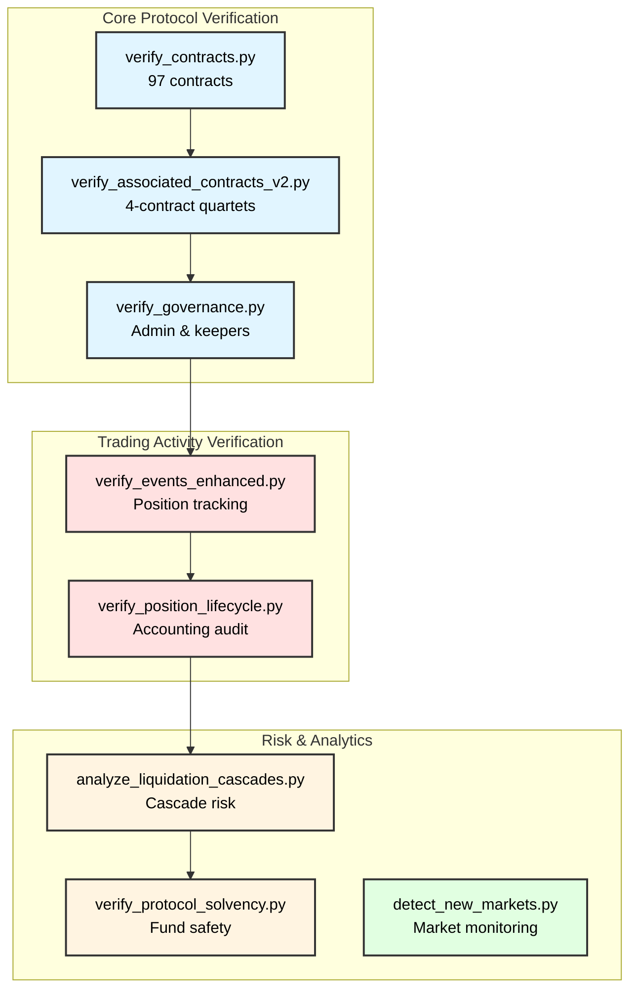
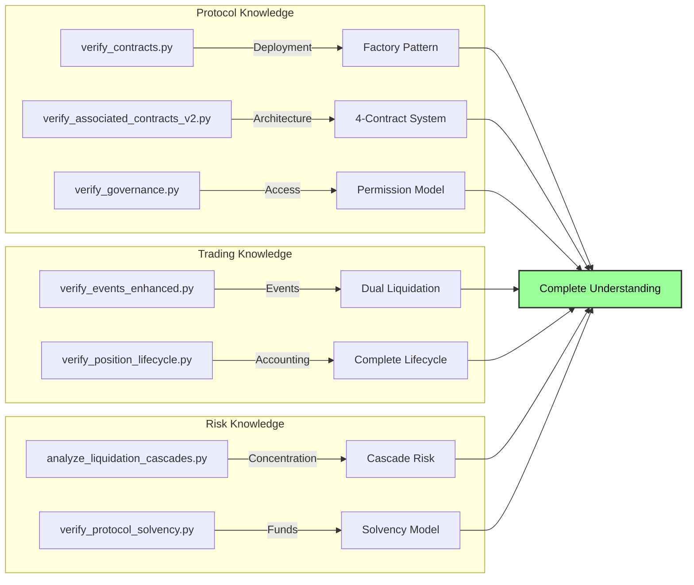

# Verification Scripts Guide

Complete guide to running and understanding all TradeSta verification scripts.

---

## Overview

This verification package contains **13 scripts** organized into three categories:



---

## Quick Start

### Run All Verifications

```bash
# Core protocol verification (contracts, governance, config)
python3 scripts/verify_all.py

# Advanced verification (positions, liquidations, solvency)
python3 scripts/verify_all_phase2.py --sample 3  # 3 markets (fast)
python3 scripts/verify_all_phase2.py --all       # All 24 markets (complete)
```

### Docker

```bash
# Build image
docker build -t tradesta-verify .

# Run core verification
docker run --rm -v $(pwd)/results:/verification/results tradesta-verify

# Run advanced verification
docker run --rm -v $(pwd)/results:/verification/results tradesta-verify \
  python3 scripts/verify_all_phase2.py --sample 3
```

---

## Core Protocol Verification

### `verify_contracts.py` - Contract Architecture

**What It Does**:
Discovers all TradeSta contracts via `MarketCreated` events and verifies the factory deployment pattern.

**How It Works**:
1. Queries `MarketCreated` events from MarketRegistry
2. Extracts PositionManager addresses from events
3. Fetches contract creation info for all contracts
4. Verifies deployer is MarketRegistry
5. Fetches ABIs and source code

**What It Proves**:
- Understanding of deployment structure
- Knowledge of factory pattern
- Ability to discover contracts without hardcoded addresses

**Run It**:
```bash
python3 scripts/verify_contracts.py
```

**Output**:
```
results/contracts_verified.json
```

**Sample Output**:
```json
{
  "total_markets": 24,
  "total_contracts": 97,
  "deployer": "0x60f16b09a15f0c3210b40a735b19a6baf235dd18",
  "contracts": [
    {
      "address": "0x8d07fa9ac8b4bf833f099fb24971d2a808874c25",
      "type": "PositionManager",
      "market": "AVAX/USD",
      "verified": true
    }
  ]
}
```

**Time**: ~30 seconds (with caching)

---

### `verify_associated_contracts_v2.py` - Four-Contract System

**What It Does**:
Discovers the complete "quartet" of contracts for each market using MarketRegistry getter functions.

**How It Works**:
1. Gets all `MarketCreated` events
2. For each pricefeed ID, calls:
   - `getPositionManagerAddress(pricefeedId)`
   - `getOrderManagerAddress(pricefeedId)`
   - `getVaultAddress(pricefeedId)`
   - `getFundingManagerAddress(pricefeedId)`
3. Verifies USDC as collateral token
4. Validates all four contracts exist for each market

**What It Proves**:
- Understanding of market composition
- Knowledge of contract relationships
- Ability to reconstruct protocol architecture

**Run It**:
```bash
python3 scripts/verify_associated_contracts_v2.py
```

**Output**:
```
results/associated_contracts_v2_verified.json
```

**Sample Output**:
```json
{
  "markets": [
    {
      "market_number": 3,
      "pricefeed_id": "0x93da...",
      "position_manager": "0x8d07fa9ac8b4bf833f099fb24971d2a808874c25",
      "orders": "0xa9bbf9dff99be1dc86a3de11a3c2a88c0186c3e6",
      "vault": "0x8ef35061505842cfb9052312e65b994ba8221cc9",
      "funding_tracker": "0x5eb128dedca5c256269d2ec1e647456c4db10503",
      "complete_quartet": true
    }
  ]
}
```

**Time**: ~10 seconds

---

### `verify_governance.py` - Access Control

**What It Does**:
Identifies admin and keeper addresses, verifies roles via RPC calls.

**How It Works**:
1. Queries `RoleGranted` events from MarketRegistry
2. Verifies admin role: `hasRole(0x00...00, address)`
3. Checks keeper whitelist: `platformContracts(address)`
4. Reports all role holders

**What It Proves**:
- Understanding of permission system
- Knowledge of OpenZeppelin AccessControl
- Ability to verify on-chain roles

**Run It**:
```bash
python3 scripts/verify_governance.py
```

**Output**:
```
results/governance_verified.json
```

**Sample Output**:
```json
{
  "admin_verified": {
    "default_admin_role": {
      "account": "0xe28bD6B3991F3e4b54AF24EA2F1eE869c8044a93",
      "has_role": true
    }
  },
  "keepers_verified": [
    {
      "address": "0xAEE2ee1c899ecB6313A3c80DDAac40f2e1f6d9C4",
      "is_whitelisted": true
    },
    {
      "address": "0x65fD3d40F9c2FD34c4ec54a3d0A0BC9900C8a3A1",
      "is_whitelisted": true
    }
  ]
}
```

**Time**: ~5 seconds

---

## Trading Activity Verification

### `verify_events_enhanced.py` - Complete Position Tracking

**What It Does**:
Tracks all position lifecycle events including both liquidation types (price-based + funding-based).

**How It Works**:
1. Queries four event types per market:
   - `PositionCreated`
   - `PositionClosed`
   - `PositionLiquidated` (price-based)
   - `CollateralSeized` (funding-based)
2. Calculates statistics:
   - Total positions created
   - Normal closure rate
   - Price liquidation rate
   - Funding liquidation rate (zero)
3. Identifies still-open positions

**What It Proves**:
- Understanding of dual liquidation mechanism
- Knowledge of complete event system
- Ability to reconstruct trading activity

**Run It**:
```bash
# Sample 3 markets (AVAX, BTC, ETH)
python3 scripts/verify_events_enhanced.py --sample 3

# All 24 markets
python3 scripts/verify_events_enhanced.py --all
```

**Output**:
```
results/events_enhanced_verified.json
```

**Sample Output**:
```json
{
  "markets": [
    {
      "position_manager": "0x8d07fa9ac8b4bf833f099fb24971d2a808874c25",
      "market_label": "AVAX/USD",
      "positions_created": 5685,
      "positions_closed": 4312,
      "positions_liquidated_price": 1359,
      "positions_liquidated_funding": 0,
      "still_open": 14,
      "closure_rate": 75.86,
      "liquidation_rate_price": 23.90,
      "liquidation_rate_funding": 0.00
    }
  ]
}
```

**Time**: ~20 seconds (3 markets), ~2 minutes (all markets)

---

### `verify_position_lifecycle.py` - Accounting Audit

**What It Does**:
Validates position accounting: `created = closed + price_liquidated + funding_liquidated + still_open`

**How It Works**:
1. Fetches all position events (reuses cached data)
2. Queries contract for currently open positions: `getAllActivePositionIds()`
3. Compares event-based count vs contract state
4. Detects anomalies:
   - **Zombie positions**: In events but not in contract (timing issue)
   - **Ghost positions**: In contract but not in events (data issue)
5. Validates accounting equation

**What It Proves**:
- Understanding of complete lifecycle
- Knowledge of event + state verification
- Ability to detect data inconsistencies

**Run It**:
```bash
python3 scripts/verify_position_lifecycle.py --sample 3
```

**Output**:
```
results/position_lifecycle_verified.json
```

**Sample Output**:
```json
{
  "markets": [
    {
      "position_manager": "0x8d07fa9ac8b4bf833f099fb24971d2a808874c25",
      "positions_created": 5685,
      "positions_settled": 5671,
      "positions_still_open_events": 14,
      "positions_still_open_contract": 14,
      "zombie_positions": 0,
      "ghost_positions": 0,
      "accounting_valid": true
    }
  ]
}
```

**Time**: ~30 seconds (3 markets)

---

## Risk & Analytics

### `analyze_liquidation_cascades.py` - Cascade Risk

**What It Does**:
Maps liquidation price levels and identifies "cascade zones" where multiple positions liquidate at the same price.

**How It Works**:
1. Queries all open positions from contract
2. Calls built-in cascade functions:
   - `findLiquidatablePricesLong()`
   - `findLiquidatablePricesShort()`
3. Groups positions by liquidation price
4. Calculates distance from current price
5. Identifies critical zones (many positions at same level)

**What It Proves**:
- Understanding of systemic liquidation risk
- Knowledge of built-in cascade detection
- Ability to assess protocol health

**Run It**:
```bash
python3 scripts/analyze_liquidation_cascades.py --sample 3
```

**Output**:
```
results/liquidation_cascades_analyzed.json
```

**Sample Output**:
```json
{
  "markets": [
    {
      "position_manager": "0x8d07fa9ac8b4bf833f099fb24971d2a808874c25",
      "total_open_positions": 14,
      "cascade_zones": 12,
      "critical_zones": 0,
      "max_positions_at_price": 2,
      "zones": [
        {
          "liquidation_price": 35.50,
          "position_count": 2,
          "distance_from_current": "5.2%",
          "risk_level": "low"
        }
      ]
    }
  ]
}
```

**Known Limitation**: Uses placeholder prices (not live Pyth data)

**Time**: ~40 seconds (3 markets)

---

### `verify_protocol_solvency.py` - Fund Safety

**What It Does**:
Verifies each market's Vault can cover all winning positions.

**How It Works**:
1. Queries Vault USDC balance: `USDC.balanceOf(vault)`
2. Gets all open positions from contract
3. Calculates unrealized PnL for each position (simplified)
4. Sums locked collateral + unrealized profits
5. Verifies: `vault_balance >= locked_collateral + unrealized_profits`

**What It Proves**:
- Understanding of solvency requirements
- Knowledge of vault security model
- Ability to verify protocol can pay winners

**Run It**:
```bash
python3 scripts/verify_protocol_solvency.py --sample 3
```

**Output**:
```
results/protocol_solvency_verified.json
```

**Sample Output**:
```json
{
  "markets": [
    {
      "position_manager": "0x8d07fa9ac8b4bf833f099fb24971d2a808874c25",
      "vault": "0x8ef35061505842cfb9052312e65b994ba8221cc9",
      "vault_balance_usdc": 3456.78,
      "locked_collateral_usdc": 2100.00,
      "unrealized_pnl_total": 150.00,
      "required_balance": 2250.00,
      "solvency_ratio": 1.54,
      "is_solvent": true
    }
  ]
}
```

**Known Limitation**: Simplified PnL calculation (uses placeholder prices)

**Time**: ~60 seconds (3 markets)

---

### `detect_new_markets.py` - Market Monitoring

**What It Does**:
Monitors for new market deployments in real-time.

**How It Works**:
1. Reads last checked block from `last_checked_block.txt`
2. Queries `MarketCreated` events since last check
3. Extracts market details (pricefeed ID, manager address)
4. Saves new markets to `new_markets.json`
5. Updates last checked block

**What It Proves**:
- Understanding of market discovery
- Knowledge of event-driven monitoring
- Ability to detect protocol changes

**Run It**:
```bash
python3 detect_new_markets.py
```

**Output**:
```
new_markets.json (if new markets found)
last_checked_block.txt (updated)
```

**Use Case**: Run periodically (cron) to alert on new markets

**Time**: ~5 seconds

---

## What Each Script Proves



---

## Performance & Caching

All scripts use aggressive caching via `scripts/utils/routescan_api.py`:

**First Run** (~10-15 minutes for full suite):
- Fetches ABIs, source code, events from Routescan API
- Stores in `cache/` directory
- Rate limited: 2 req/sec (respectful of API limits)

**Subsequent Runs** (~1-2 minutes for full suite):
- Reads from cache
- Only queries contract state (RPC calls)
- ~0 Routescan API requests

**Cache Structure**:
```
cache/
├── abi_0x8d07fa9ac8b4bf833f099fb24971d2a808874c25.json
├── source_0x8d07fa9ac8b4bf833f099fb24971d2a808874c25.json
└── logs/
    └── addr_0x8d07fa9a_t0_0xd5f0ee03_fb_63000000_tb_latest.json
```

**To Force Refresh**:
```bash
rm -rf cache/
python3 scripts/verify_all.py
```

---

## Troubleshooting

### "No records found" Errors

**Cause**: Routescan API returns empty results for some queries

**Fix**: Scripts handle gracefully (treats as zero events)

### Rate Limit Errors

**Cause**: Exceeded 120 req/min or 10,000 req/day

**Fix**: Scripts enforce 0.5s between requests. Wait and retry.

### Contract Call Reverts

**Cause**: Contract function doesn't exist or wrong parameters

**Fix**: Verify ABI is correct and contract is deployed

### Stale Cache

**Cause**: Cached data is from previous blocks

**Fix**: Delete cache or use fresh block range

---

## Integration Examples

### CI/CD Verification

```bash
#!/bin/bash
# Run verification and check exit codes

python3 scripts/verify_all.py || exit 1
python3 scripts/verify_all_phase2.py --sample 3 || exit 1

echo "✅ All verifications passed"
```

### Monitoring Dashboard

```python
import json
from pathlib import Path

# Load latest results
with open('results/events_enhanced_verified.json') as f:
    data = json.load(f)

# Alert on high liquidation rate
for market in data['markets']:
    if market['liquidation_rate_price'] > 50:
        print(f"⚠️  High liquidation rate: {market['market_label']} - {market['liquidation_rate_price']:.1f}%")
```

### Custom Analysis

```python
from scripts.utils.routescan_api import RoutescanAPI

api = RoutescanAPI()

# Get all PositionCreated events
events = api.get_all_logs(
    address="0x8d07fa9ac8b4bf833f099fb24971d2a808874c25",
    topic0="0xd5f0ee03a771aa6da9e03bd4a5c7e0c80c8d6e3e9b5c5e5d5f5e5d5f5e5d5f5e",
    from_block=63_000_000,
    to_block="latest"
)

print(f"Total positions: {len(events)}")
```

---

## Summary

This verification suite provides **complete protocol understanding** through:

✅ **Event-Driven Discovery**: No hardcoded addresses
✅ **Cross-Verification**: Events + contract state
✅ **Statistical Analysis**: Rates, distributions, anomalies
✅ **Risk Assessment**: Cascades, solvency, funding
✅ **Continuous Monitoring**: Detect new markets

**All using only public data** (Routescan API + Avalanche RPC)

---

**For protocol mechanics**, see [PROTOCOL_GUIDE.md](PROTOCOL_GUIDE.md)

**For technical implementation**, see [TECHNICAL_DETAILS.md](TECHNICAL_DETAILS.md)
